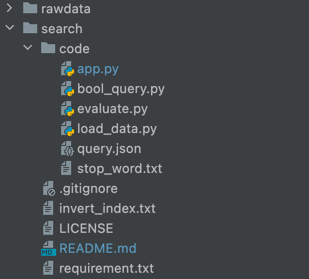

# 文献检索
**XMU2022**
**Author： Bc-Gg**

## 介绍
一个简单的检索系统，在用停用词表进行单词表的预处理之后形成倒排索引表，最后形成图形化界面进行查询

## QuickStart
1. 请将文件规划为如下文件树路径  
PS：其中rawdata文件夹下是数据集的解压缩包。  

2. 请在cmd中一行一行输入如下命令
```shell
cd (YOUR DIRPATH)
conda activate (YOUR ENV NAME)
pip3 install -r requirements.txt
python3 load_data.py
python3 app.py
```

### 22/06/24 TODO 
1. 图形化界面
2. 任务5
### 22/06/25 TODO 
1. 任务5
2. tfidf的索引建立与搜索
### 2022/06/29 
1. 注释(看心情)
### 2022/0705
1. 解决了query文件的最后的写入
2. 就不写注释了
